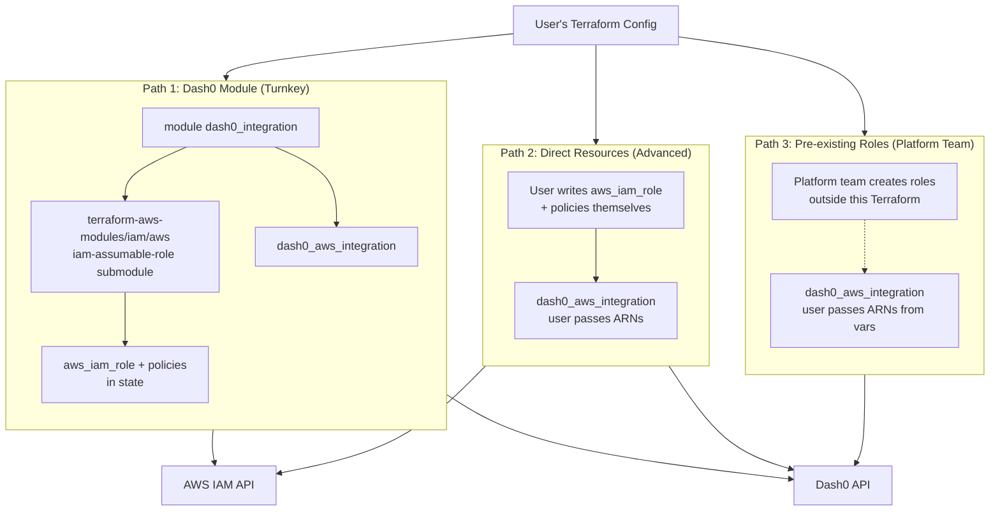

# Dash0 AWS Integration — Proposed 3-Path Approach

## Overview

Instead of one monolithic `dash0_aws_integration` resource that creates AWS IAM roles via the AWS SDK (current impl), split the concerns:
- **Terraform AWS provider** (or `terraform-aws-modules/iam/aws`) creates IAM roles — standard Terraform best practice
- **Dash0 provider** only registers the integration with the Dash0 API

Users pick the path that matches their workflow.

---

## Architecture



---

## Path Comparison

| Dimension | Path 1: Module | Path 2: Direct | Path 3: Pre-existing |
|-----------|----------------|----------------|----------------------|
| **Audience** | Most users (90%) | Advanced / custom IAM | Enterprise / platform teams |
| **DX** | ~10 lines (same as today) | ~30 lines | ~6 lines |
| **Who creates IAM roles** | Module (via `terraform-aws-modules/iam/aws`) | User | Platform team (outside TF) |
| **AWS provider needed** | Yes | Yes | No |
| **AWS creds needed** | Yes (on `aws` provider) | Yes (on `aws` provider) | No |
| **`default_tags` cascade** | ✅ via `providers = { aws = aws }` | ✅ automatic | N/A |
| **Explicit tags fallback** | ✅ via `tags` variable | ✅ on each resource | N/A |
| **Lifecycle rules on IAM** | Limited (inside module) | ✅ Full | N/A |
| **Supported today?** | ❌ | ❌ | ❌ Impossible |

---

## Path 1: Module (Turnkey — recommended for most users)

### Mode A — Provider pass-through (recommended)

Cascades `default_tags` from the user's root `aws` provider into the module:

```hcl
terraform {
  required_providers {
    aws   = { source = "hashicorp/aws" }
    dash0 = { source = "dash0hq/dash0" }
  }
}

provider "aws" {
  region = "us-east-1"
  default_tags {
    tags = { Team = "platform", ManagedBy = "terraform" }
  }
}

provider "dash0" {
  url        = "https://api.dash0.com"
  auth_token = var.dash0_token
}

module "dash0_integration" {
  source  = "dash0hq/dash0-aws-integration/aws"
  version = "~> 1.0"

  external_id            = var.dash0_org_id
  dataset                = "default"
  enable_instrumentation = true

  # Provider pass-through — default_tags cascade automatically
  providers = { aws = aws }
}
```

### Mode B — Explicit tags (fallback)

For users who don't want provider pass-through (or need per-module tag overrides):

```hcl
module "dash0_integration" {
  source  = "dash0hq/dash0-aws-integration/aws"
  version = "~> 1.0"

  external_id            = var.dash0_org_id
  dataset                = "default"
  enable_instrumentation = true

  # Explicit tags (escape hatch — no provider pass-through required)
  tags = { Env = "prod", Team = "platform" }
}
```

### Mode C — Both combined

Provider `default_tags` for global tags + `tags` variable for module-specific additions. They merge automatically.

### How it works internally

The module uses `terraform-aws-modules/iam/aws` submodules (battle-tested, maintained by HashiCorp community) to create roles, then calls our `dash0_aws_integration` resource. Rough sketch:

```hcl
# modules/dash0-aws-integration/main.tf
data "aws_caller_identity" "current" {}

# Trust policy with Dash0 account + external ID condition
data "aws_iam_policy_document" "dash0_trust" {
  statement {
    actions = ["sts:AssumeRole"]
    principals {
      type        = "AWS"
      identifiers = ["arn:aws:iam::${var.dash0_aws_account_id}:root"]
    }
    condition {
      test     = "StringEquals"
      variable = "sts:ExternalId"
      values   = [var.external_id]
    }
  }
}

# Read-only role via terraform-aws-modules/iam/aws
module "readonly_role" {
  source  = "terraform-aws-modules/iam/aws//modules/iam-assumable-role"
  version = "~> 5.0"

  create_role             = true
  role_name               = "${var.iam_role_name_prefix}-read-only"
  custom_role_trust_policy = data.aws_iam_policy_document.dash0_trust.json
  custom_role_policy_arns = [
    "arn:aws:iam::aws:policy/job-function/ViewOnlyAccess",
  ]
  tags = var.tags
}

# Custom inline policy for resource discovery
resource "aws_iam_role_policy" "readonly_custom" {
  name   = "Dash0ReadOnly"
  role   = module.readonly_role.iam_role_name
  policy = file("${path.module}/policies/readonly.json")
}

# Instrumentation role (conditional)
module "instrumentation_role" {
  count   = var.enable_instrumentation ? 1 : 0
  source  = "terraform-aws-modules/iam/aws//modules/iam-assumable-role"
  version = "~> 5.0"

  create_role             = true
  role_name               = "${var.iam_role_name_prefix}-instrumentation"
  custom_role_trust_policy = data.aws_iam_policy_document.dash0_trust.json
  tags                    = var.tags
}

# Register with Dash0
resource "dash0_aws_integration" "this" {
  dataset        = var.dataset
  external_id    = var.external_id
  aws_account_id = data.aws_caller_identity.current.account_id

  read_only_role_arn       = module.readonly_role.iam_role_arn
  instrumentation_role_arn = var.enable_instrumentation ? module.instrumentation_role[0].iam_role_arn : null
}
```

> **Note**: Exact variable names for `iam-assumable-role` (e.g., `custom_role_trust_policy` vs `trusted_role_arns` + `role_sts_externals`) to be verified against the module docs at implementation time.

### Version compatibility

Use flexible constraints in the module so users aren't locked to a specific AWS provider major:

```hcl
# modules/dash0-aws-integration/versions.tf
terraform {
  required_version = ">= 1.0"
  required_providers {
    aws   = { source = "hashicorp/aws",  version = ">= 5.0" }
    dash0 = { source = "dash0hq/dash0",  version = ">= 1.0" }
  }
}
```

---

## Path 2: Direct Resources (Advanced)

For users who want full control — custom policies, `lifecycle { ignore_changes }`, cross-resource refs, etc. Unchanged from original plan.

```hcl
provider "aws"   { region = "us-east-1" }
provider "dash0" { ... }

data "aws_caller_identity" "current" {}

data "aws_iam_policy_document" "dash0_trust" {
  statement {
    actions = ["sts:AssumeRole"]
    principals {
      type        = "AWS"
      identifiers = ["arn:aws:iam::115813213817:root"]
    }
    condition {
      test     = "StringEquals"
      variable = "sts:ExternalId"
      values   = [var.dash0_org_id]
    }
  }
}

resource "aws_iam_role" "dash0_readonly" {
  name               = "dash0-read-only"
  assume_role_policy = data.aws_iam_policy_document.dash0_trust.json
}

resource "aws_iam_role_policy_attachment" "dash0_readonly_view" {
  role       = aws_iam_role.dash0_readonly.name
  policy_arn = "arn:aws:iam::aws:policy/job-function/ViewOnlyAccess"
}

resource "aws_iam_role_policy" "dash0_readonly_custom" {
  role   = aws_iam_role.dash0_readonly.name
  policy = file("policies/dash0-readonly.json")
}

resource "dash0_aws_integration" "this" {
  dataset         = "default"
  external_id     = var.dash0_org_id
  aws_account_id  = data.aws_caller_identity.current.account_id
  read_only_role_arn = aws_iam_role.dash0_readonly.arn
}
```

---

## Path 3: Pre-existing Roles (Platform Team)

Platform/SRE team centrally manages all IAM roles; application teams only register integrations. Unchanged from original plan.

```hcl
provider "dash0" { ... }

# ARNs provided by platform team via var, SSM, or Vault
variable "dash0_readonly_role_arn" {}
variable "dash0_instrumentation_role_arn" { default = null }

resource "dash0_aws_integration" "this" {
  dataset        = "default"
  external_id    = var.dash0_org_id
  aws_account_id = var.aws_account_id

  read_only_role_arn       = var.dash0_readonly_role_arn
  instrumentation_role_arn = var.dash0_instrumentation_role_arn
}
```

---

## What Ships from Our Side

| Artifact | Repo | Contents |
|----------|------|----------|
| **Terraform provider** | `dash0hq/terraform-provider-dash0` | `dash0_aws_integration` resource (Dash0 API only, ~150 LOC, no AWS SDK) |
| **Terraform module** | `dash0hq/terraform-aws-dash0-integration` | Composes `terraform-aws-modules/iam/aws` + `dash0_aws_integration`, published to registry |
| **Go library `aws/` package** | `dash0hq/dash0-api-client-go` | IAM logic for CLI + operator (not used by Terraform) |

---

## Why This is Better Than the Current Approach

1. **Terraform best practice** — IAM roles live in state as `aws_iam_role` resources (managed by `terraform-aws-modules/iam/aws`)
2. **AWS provider features work** — `default_tags` cascade via `providers = { aws = aws }`; `ignore_changes`, `moved` blocks all work
3. **Supports all user workflows** — turnkey (Path 1), custom (Path 2), platform-managed (Path 3)
4. **Reuses community modules** — `terraform-aws-modules/iam/aws` is battle-tested; we don't reimplement IAM role creation
5. **Flexible tagging** — provider pass-through OR explicit tags variable OR both (merged)
6. **Much smaller provider** — ~1000 LOC removed, no AWS SDK dependency
7. **All review concerns dissolve** — no `RequiresReplace` on creds, no IAM idempotency, no 10s propagation wait, no custom drift detection

---

## Migration Path for Current Users

None yet — PR #64 hasn't been merged/released. We ship the new design on first release.